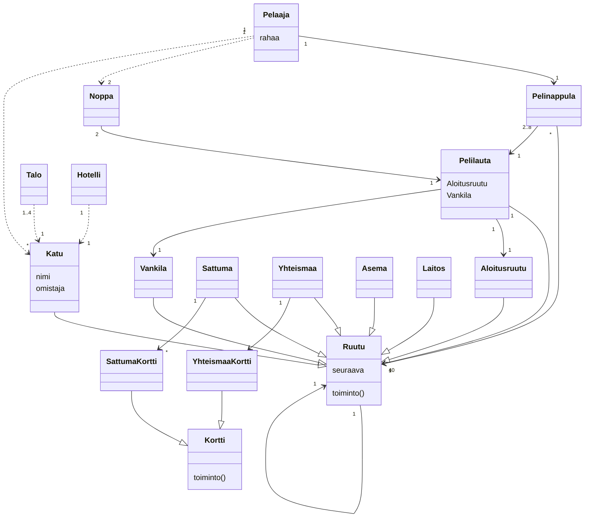

```mermaid
classDiagram
    Pelilauta "1" --> "40" Ruutu
    Pelaaja "1" --> "1" Pelinappula
    Pelinappula "*" --> "1" Ruutu
    Pelinappula "2..8" --> "1" Pelilauta
    Noppa "2" --> Pelilauta
    Pelaaja "1" ..> "2" Noppa
    Ruutu "1" --> "1" Ruutu
    Vankila --|> Ruutu
    Aloitusruutu --|> Ruutu
    Sattuma --|> Ruutu
    Yhteismaa --|> Ruutu
    Asema --|> Ruutu
    Laitos --|> Ruutu
    Katu --|> Ruutu
    Pelilauta "1" --> "1" Aloitusruutu
    Pelilauta "1" --> "1" Vankila
    class Pelaaja{
        rahaa
    }
    class Pelilauta{
        Aloitusruutu
        Vankila
    }
    class Ruutu{
        seuraava
        toiminto()
    }
    class Vankila{

    }
    class Aloitusruutu{

    }
    class Asema
    class Laitos
    Pelaaja "1" ..> "*" Katu
    class Katu{
        nimi
        omistaja
    }
    Talo "1..4" ..> "1" Katu
    Hotelli "1" ..> "1" Katu
    Sattuma "1" --> "*" SattumaKortti
    Yhteismaa "1" --> "*" YhteismaaKortti
    class Talo
    class Hotelli
    class Noppa
    class Pelinappula
    class Kortti{
        toiminto()
    }
    class SattumaKortti
    class YhteismaaKortti
    SattumaKortti --|> Kortti
    YhteismaaKortti --|> Kortti
```