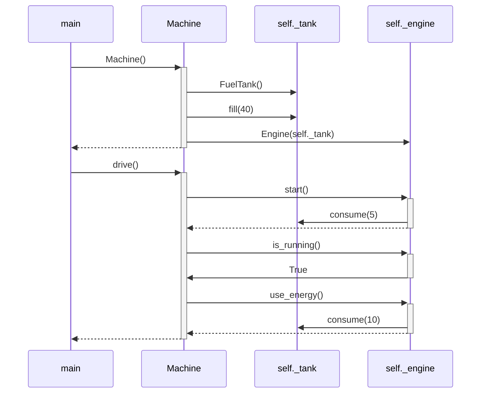

```mermaid
sequenceDiagram
    main->>+Machine: Machine()
    Machine->>self._tank: FuelTank()
    Machine->>self._tank: fill(40)
    Machine->>self._engine: Engine(self._tank)
    Machine-->>-main: 
    main->>+Machine: drive()
    Machine->>+self._engine: start()
    self._engine->>self._tank: consume(5)
    self._engine-->>-Machine: 
    Machine->>+self._engine: is_running()
    self._engine->>-Machine: True
    Machine->>+self._engine: use_energy()
    self._engine->>self._tank: consume(10)
    self._engine-->>-Machine: 
    Machine-->>-main: 
```