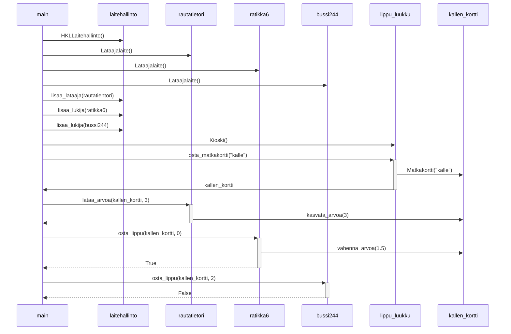

```mermaid
sequenceDiagram
participant m as main
participant lh as laitehallinto
participant r as rautatietori
participant r6 as ratikka6
participant b244 as bussi244
participant ll as lippu_luukku
participant kk as kallen_kortti
m->>lh: HKLLaitehallinto()
m->> r: Lataajalaite()
m->> r6: Lataajalaite()
m->> b244: Lataajalaite()
m->>lh: lisaa_lataaja(rautatientori)
m->>lh: lisaa_lukija(ratikka6)
m->>lh: lisaa_lukija(bussi244)
m->>ll: Kioski()
m->>+ll: osta_matkakortti("kalle")
ll->>kk: Matkakortti("kalle")
ll->>-m: kallen_kortti
m->>+r: lataa_arvoa(kallen_kortti, 3)
r->>kk: kasvata_arvoa(3)
r-->>-m: 
m->>+r6: osta_lippu(kallen_kortti, 0)
r6->>kk: vahenna_arvoa(1.5)
r6-->>-m: True
m->>+b244: osta_lippu(kallen_kortti, 2)
b244-->>-m: False
```